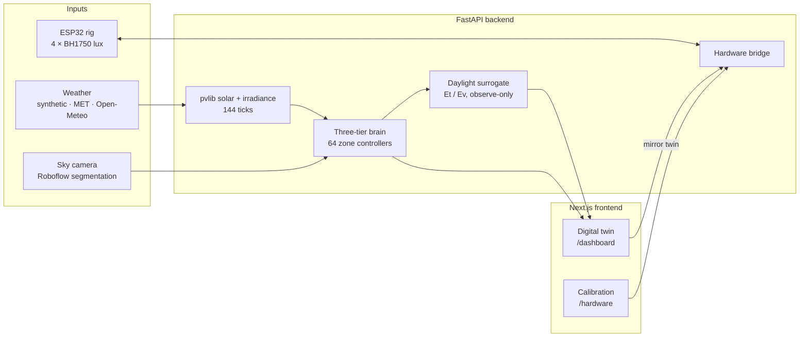

# NeuroSkin

**Explainable adaptive-facade control: a 3D digital twin, a three-tier controller and a
physical louvre rig, modelled on the ST Diamond Building in Putrajaya, Malaysia.**


> **Status:** demo-ready simulation proof. NeuroSkin is **not** a production
> building-control system. Its energy, comfort and daylight figures are model outputs, not
> measured results. See [Scope and limitations](#scope-and-limitations).

---

## Contents

- [Overview](#overview)
- [Key features](#key-features)
- [Architecture](#architecture)
- [Getting started](#getting-started)
- [Using the application](#using-the-application)
- [API](#api)
- [Hardware rig](#hardware-rig)
- [Daylight surrogate pipeline](#daylight-surrogate-pipeline)
- [Testing](#testing)
- [Target building](#target-building)
- [Scope and limitations](#scope-and-limitations)
- [Documentation](#documentation)
- [References](#references)

## Overview

Adaptive facades move louvres in response to sun, sky and occupancy. However, they rarely show
*why* a blade moved, whether the sensor that triggered it could be trusted, or what the move
cost in daylight and heat. NeuroSkin makes each of those decisions visible.

The backend simulates a full day at 10-minute resolution (144 ticks) across four facades and
64 independently controlled zones. The frontend replays that day on an interactive 3D model
of the building. The simulation demonstrates the controller in three tiers:

| Tier | Question it answers | What it demonstrates |
| --- | --- | --- |
| **1. Sensor trust** | Can this irradiance reading be believed? | A solar-almanac and cloud cross-check catches a failed sensor before it drives the facade. |
| **2. Co-optimisation** | What is the best angle right now? | A multi-objective controller balances daylight (300–700 lux), solar heat gain, a glare screen and movement cost. It is compared against a naive threshold controller. |
| **3. Movement budget and fail-safe** | Is the move safe and worth making? | Rate-limited continuous tracking, plus wind, rain and power safety overrides. |

The same twin also drives learned occupant-plane daylight estimates and a small ESP32
louvre rig.

## Key features

- **Interactive digital twin.** A three.js model shows 7 storeys with 25° outward-leaning
  walls. It includes a per-zone irradiance heatmap, the sun's path, shadows and cloud cover
  from a vision model. Four lenses cover the building: *Building*, *Floor*, *Brains* and
  *Feeds*.
- **64 independent zone controllers.** Each facade is split into a 4×4 grid of zones. Every
  zone has its own simulated irradiance and illuminance sensors and its own actuator state,
  and all zones follow one shared policy.
- **Physics-based environment.** [pvlib](https://pvlib-python.readthedocs.io/) provides solar
  position and Perez plane-of-array irradiance. Surface temperatures use the ASHRAE sol-air
  model. Louvre optics model both direct-beam and diffuse transmission.
- **Choice of weather sources.** Choose fully synthetic weather, MET Malaysia-anchored
  forecasts or [Open-Meteo](https://open-meteo.com/) forecast and ERA5 reanalysis data. Any
  latitude and longitude can be used.
- **Cloud vision.** Sky-camera frames go through Roboflow cloud segmentation, and the result
  feeds the Tier 1 sensor-trust check.
- **Daylight surrogate models.** Extra Trees models estimate task illuminance (Et) and eye
  illuminance (Ev). They were trained on a radiosity oracle and run in observe-only mode.
- **ESP32 hardware bridge.** The rig has four BH1750 light sensors and four servo-driven
  louvres. It runs either in autonomous lux control or mirrors the twin, and has a dedicated
  calibration page.

## Architecture



| Layer | Stack |
| --- | --- |
| Frontend | Next.js 15, React 19, TypeScript, Tailwind CSS, three.js, Recharts, Vitest |
| Backend | FastAPI, Pydantic 2, pvlib, NumPy, pandas, SciPy, scikit-learn |
| Firmware | ESP32 (Arduino core 3.x), BH1750, Adafruit PWM Servo Driver (PCA9685), ArduinoJson 7 |
| Tooling | uv, npm, Ruff, ESLint, pytest, Docker Compose, Jupyter |

```text
.
├── backend/
│   ├── app/              FastAPI app: API, hardware bridge, vision, weather
│   │   └── domain/       Solar, optics, controller, safety, daylight models
│   ├── notebooks/        Daylight surrogate training notebook
│   ├── scripts/          Dataset generation, ablation and benchmark scripts
│   └── tests/            pytest suite
├── frontend/src/
│   ├── app/              Routes: /, /dashboard, /hardware
│   ├── components/       Digital twin, charts, hardware panels
│   └── lib/api-client.ts Typed backend client
├── hardware/
│   ├── README.md         Wiring, flashing and bridge operation
│   └── esp32/            ESP32 firmware
├── docs/                 PRDs, technical notes and experiment evidence
├── compose.yml
└── Makefile
```

## Getting started

### Prerequisites

- Python 3.10+ and [uv](https://docs.astral.sh/uv/)
- Node.js 20+ and npm
- *Optional:* Docker, for Compose
- *Optional:* the Arduino IDE with ESP32 core 3.x, for the hardware rig

### Install and run

```bash
make install   # uv sync --extra dev, then npm install
make dev       # backend on :8000, frontend on :3000 (Ctrl-C stops both)
```

| Service | URL |
| --- | --- |
| Web application | http://localhost:3000 |
| API docs (OpenAPI) | http://localhost:8000/docs |
| Health check | http://localhost:8000/api/v1/health |

You can also run `make backend` and `make frontend` in separate terminals, or use Docker:

```bash
docker compose up --build
```

### Configuration

Copy `backend/.env.example` to `backend/.env`. `make backend` loads the file automatically
when it exists. Every variable is optional, and the core simulation runs without any of them.

| Variable | Used by | Behaviour when unset |
| --- | --- | --- |
| `ROBOFLOW_API_KEY` | Cloud vision (`POST /api/v1/vision/clouds`) | The endpoint returns `503`, and the twin falls back to weather-based cloud cover. |
| `HARDWARE_TOKEN` | ESP32 bridge (`POST /api/v1/hardware/tick`) | The endpoint returns `503`, so the rig cannot connect. |
| `LOG_LEVEL` | JSON-line application logs | `INFO` |

The frontend reads `NEXT_PUBLIC_API_URL`, which defaults to `http://localhost:8000`. Keep
secrets out of `NEXT_PUBLIC_*` variables, because those are shipped to the browser.

## Using the application

| Route | Purpose |
| --- | --- |
| `/` | Product overview and entry point to each application |
| `/dashboard` | Facade digital twin. **Run simulation** plays a clear, healthy west-facade solar-tracking day. **Run diagnostic tests** runs the fault/optimisation/fail-safe tiers separately. Select any zone to inspect its inputs, decision and objective. |
| `/demo` | Sensor-only hardware demo. Opening it disconnects twin control; four BH1750 sensors independently drive the physical 2×2 louvres through the laptop bridge. |
| `/hardware` | Actuator calibration for the ESP32 rig: map each servo's 0–180° range and test poses. |

The dashboard can also switch between the controlled facade and a **no-external-facade
baseline** of the same building. This comparison shows how much irradiance the louvres
remove.

In **Floor**, choose **Set up meeting demo** to open West Floor 7 with people at seats
1–4 and 13–14. The meeting starts with high Ev/Et. **Simulate glare** sweeps W13
from 0° to the model-selected 117°, shifts the illustrated sunlight opening, and
shows green comfort readings when BH1 reports the end of its sweep (7.5 seconds
for the simulation without hardware); the other 15 west zones hold. Seats 13–14 remain
under scripted local cloud shade. The angle is selected using the existing optics
and independent-room radiosity model, separately from the normal day's controller.
**Simulate glare** also connects the online rig automatically: BH1 demonstrates a
full **0° → 180°** prototype sweep, separately labelled from the modelled shading angle,
while BH2–BH4 retain their captured commanded angles. Reset prepares another sweep; exiting
returns a rig controlled by this demo to sensor mode. These are modelled predictions,
not live cloud or occupancy detections.
The sunlight rays and tabletop highlight follow BH1's reported servo command,
polled every 500 ms and smoothed between updates. The full prototype travel maps
to the modelled shading pose; SG90 servos do not provide physical position feedback.

## API

| Method | Path | Description |
| --- | --- | --- |
| `GET` | `/api/v1/health` | Liveness, plus the last observed status of each upstream provider |
| `GET` | `/api/v1/config` | Default site, geometry, limits, weather sources and scenarios |
| `POST` | `/api/v1/simulations/run` | Run a full-day facade scenario |
| `POST` | `/api/v1/vision/clouds` | Segment clouds in a base64 JPEG sky frame |
| `POST` | `/api/v1/hardware/tick` | ESP32 posts lux readings and receives louvre angles (requires `X-Hardware-Token`) |
| `GET` | `/api/v1/hardware/status` | Latest rig readings, mode and commanded angles |
| `POST` | `/api/v1/hardware/control` | Set the rig mode: `auto`, `twin` or `calibrate` (loopback only) |
| `POST` | `/api/v1/hardware/calibration` | Save per-servo calibration (loopback only) |

Run a seeded scenario:

```bash
curl -X POST http://localhost:8000/api/v1/simulations/run \
  -H 'Content-Type: application/json' \
  -d '{"scenario": "lie_detector", "seed": 42}'
```

Run a scenario on measured weather at the target building:

```bash
curl -X POST http://localhost:8000/api/v1/simulations/run \
  -H 'Content-Type: application/json' \
  -d '{
        "scenario": "overview",
        "date": "2026-03-21",
        "environment_source": "open_meteo",
        "latitude": 2.9220,
        "longitude": 101.6885,
        "timezone": "Asia/Kuala_Lumpur",
        "facade_orientation": "west",
        "facade_tilt": 115
      }'
```

| Parameter | Values |
| --- | --- |
| `scenario` | `overview`, `lie_detector`, `co_optimization`, `budget_failsafe` |
| `environment_source` | `synthetic` (default), `met_anchored` (7-day MET Malaysia forecast window), `open_meteo` |
| `facade_tilt` | pvlib surface tilt in degrees: `90` is an upright wall, `115` is the Diamond Building's 25° overhang |
| `daylight_model_enabled` | `true` adds observe-only Et/Ev estimates (requires trained model artifacts) |
| `zone_perturbations` | Declared test windows per zone, e.g. `{"W6": {"kind": "dead", "start_tick": 78, "end_tick": 96}}`; kinds `dead`, `stuck`, `drift`, `fouled` corrupt the reading, `shadow` is a real unmodelled drop |
| `fault_correction` | `off` (default, unchanged response), `monitor` (peer/lux assurance evidence and episodes, no action), `review` (isolation only for approved episodes), `auto` (dead/stuck isolated automatically) |
| `approved_episodes` | Episode ids such as `W6:80:dead`; the run replays deterministically with those isolations authorised |

Upstream weather responses are cached. If a provider is unavailable, the run falls back to
synthetic weather and reports the reason in `metadata.weather_context`. Every response carries
an `X-Request-ID` header.

## Hardware rig

A 2×2 grid of louvre panels stands in for one 2×2 block of the twin's west wall. Each panel
has one SG90 servo, driven through a PCA9685 board, and one BH1750 light sensor. Every 500 ms
the ESP32 posts four lux readings to the backend and receives four angles in return.

- **Demo 1 · Follow simulation:** select this in the dashboard's Hardware demo card,
  then play or run the simulation. The rig follows W13/W14/W9/W10 at the displayed
  time, with matching blade angles (no angle multiplier). Angles continuously track the sun’s wall-section profile: 0° overhead, 90° at a 45° profile, approaching 180° at the facing horizon. Travel remains rate-limited. Mirroring slows playback to one second per tick; scrubbing also updates the rig.
- **Demo 2 · Sensor only (default):** select this in the card or open `/demo` for a
  dedicated corner-light demonstration without loading a simulation. Each BH1750
  independently steps its panel toward shading above 700 lux and open below 300 lux.
  The laptop backend and ESP32 stay connected; control continues with the page closed.

Quick setup:

```bash
cp hardware/esp32/neuroskin_bridge/secrets.h.example hardware/esp32/neuroskin_bridge/secrets.h
python3 -c "import secrets; print(secrets.token_urlsafe(24))"   # use as HARDWARE_TOKEN
make backend HOST=0.0.0.0                                        # expose the API on the LAN
```

1. Fill in `secrets.h` with your WiFi details, the laptop's LAN URL and the token.
   `secrets.h` is gitignored.
2. Set the same token as `HARDWARE_TOKEN` in `backend/.env`.
3. Flash `hardware/esp32/neuroskin_bridge` from the Arduino IDE.

See [`hardware/README.md`](hardware/README.md) for wiring, the angle convention, calibration
and troubleshooting. SG90 servos give no position feedback, so every angle shown is the
*commanded* angle, not a measured one.

## Daylight surrogate pipeline

The daylight models are trained offline and never in the request path.

```bash
make daylight-data                # generate oracle samples (append ARGS=--smoke for a quick run)
make daylight-train               # execute the training notebook in place
make daylight-ablate              # run the controller glare-blindness experiment
make assurance-matrix             # seeded sensor-fault and recovery matrix (ARGS=--smoke)
```

Model artifacts are written to `backend/data/daylight/models/`, which is gitignored because
the files are large. A fresh clone must regenerate them before it can use
`daylight_model_enabled`. Without the artifacts, the estimates are reported as unavailable,
never as zero.

On structural holdout data (unseen days and zones), the Extra Trees models reach an MAE of
about 106 lux for Et and 107 lux for Ev. These errors measure agreement with the modelled
oracle, not measured occupant comfort. Full results, dataset hashes and the method are in
[`docs/appendix/daylight-training-results.md`](docs/appendix/daylight-training-results.md).

## Testing

```bash
make test                          # pytest + Vitest

cd backend && uv run ruff check app tests
cd frontend && npm run lint && npm run build
```

## Target building

The defaults model the **ST Diamond Building**, the Energy Commission (Suruhanjaya Tenaga)
headquarters in Precinct 2, Putrajaya (2.9220 N, 101.6885 E).

| Parameter | Value |
| --- | --- |
| Facade tilt | 25° outward overhang (`facade_tilt = 115`) |
| Floors | 7 |
| Gross floor area | 14,230 m² |
| Design intent | North and south facades self-shaded year-round; east and west solar impact cut by 41% |

Against an upright wall, the modelled overhang cuts annual direct beam on the north facade by
90% and on the south facade by 87%. The 3D massing is reconstructed from published figures,
not measured drawings: a square of about 34.6 m at ground level flares to about 54.7 m at the
roof. Treat the geometry as representative; the tilt physics carries the analysis.

## Scope and limitations

NeuroSkin is built to make controller behaviour inspectable, not to claim savings.

- **Cooling load is a relative index.** It is never converted into kWh, carbon, cost or
  payback.
- **Sensor and occupancy data are simulated.** This includes indoor readings, injected faults
  and zone sensors. MET and Open-Meteo data are forecasts or reanalysis, not building
  telemetry.
- **Fault detection and recovery are simulated and uncommissioned.** A healthy simulated
  sensor is its model plus noise, so the [fault matrix](docs/appendix/assurance-matrix-results.md)
  is an upper bound. Isolation substitutes peer-scaled inputs; it is not a repair.
- **Cloud-vision coverage is a demo sky estimate.** It is not calibrated hemispheric cloud
  cover, and the projected cloud shadows are illustrative.
- **Et and Ev values are modelled, observe-only estimates.** They do not change controller
  decisions and are not measured comfort. The glare screen is a tunable threshold, not a glare
  standard.
- **The hardware rig is demo-scale.** Its control endpoints accept loopback requests only,
  the API has no TLS or user authentication, and it must not be exposed to the public
  internet.

## Documentation

| Document | Contents |
| --- | --- |
| [`docs/neuroskin_product_prd.md`](docs/neuroskin_product_prd.md) | Product positioning, selling points and target requirements |
| [`docs/neuroskin_software_prd.md`](docs/neuroskin_software_prd.md) | As-built requirements, architecture, acceptance evidence and known gaps |
| [`docs/technical-notes.md`](docs/technical-notes.md) | Detailed notes on the heat map, zone controllers, cloud vision and dashboard behaviour |
| [`hardware/README.md`](hardware/README.md) | ESP32 wiring, firmware, calibration and bridge operation |
| [`docs/appendix/`](docs/appendix/) | Reproducible experiment results and evaluation ledgers |

## References

- [Diamond Building, Suruhanjaya Tenaga](https://www.st.gov.my/about-us/diamond-building)
- [ST Diamond Building, IEN Consultants](https://www.ien.com.my/projects/st-diamond-building)
- [Malaysia Energy Commission Headquarters, HPB Magazine](https://www.hpbmagazine.org/malaysia-energy-commission-headquarters-putrajaya-malaysia/)
- Tabatabaei Manesh et al. (2025), daylight surrogate method precedent, [doi:10.1016/j.autcon.2025.106474](https://doi.org/10.1016/j.autcon.2025.106474)
- [pvlib python](https://pvlib-python.readthedocs.io/), [Open-Meteo](https://open-meteo.com/), [MET Malaysia open data](https://data.gov.my/), [Roboflow Workflows](https://inference.roboflow.com/workflows/modes_of_running/)
