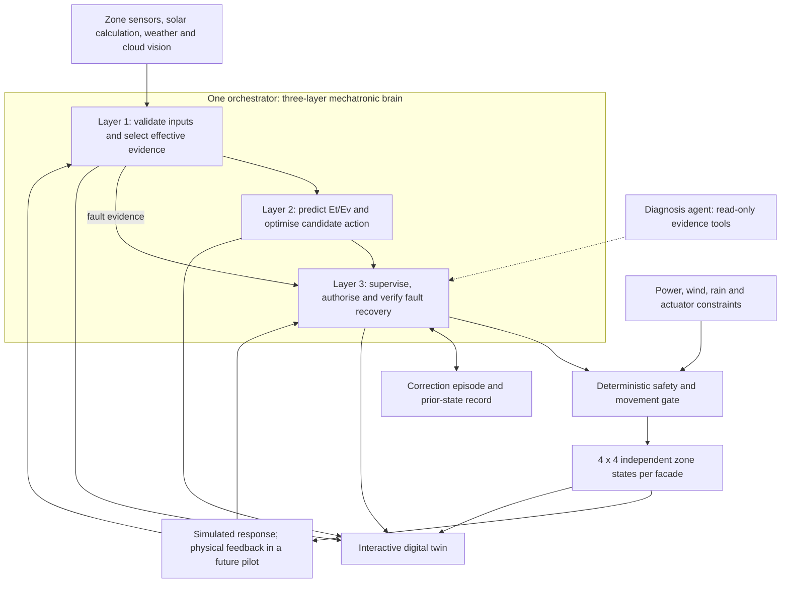

# NeuroSkin Product Requirements Document

## Product direction: three defining selling points

| Field | Value |
| --- | --- |
| Version | 1.0 — product positioning and target requirements |
| Date | 13 September 2026 |
| Audience | Product evaluators, controls engineers and prospective facility partners |
| Current release | Interactive simulation and model-development demonstration |
| Target release | Coordinated zone control with verified automatic fault correction |
| Implementation baseline | [As-built software PRD v0.5](neuroskin_software_prd.md), code through `ac942da` |

This document establishes the product story and the requirements needed to deliver it.
**Implemented** refers to verified software behaviour in the simulation. **Planned** refers
to requirements that still need implementation and evidence. Physical sensors, actuator
feedback and live building control are outside the current release.

## 1. Positioning and finalised selling points

**Target positioning:** NeuroSkin is an adaptive-facade platform that makes control decisions
visible, responds independently to local zones, and combines physics, learned daylight
prediction and supervised fault recovery in one three-layer mechatronic brain.

| Selling point | Product promise | Value to the user |
| --- | --- | --- |
| **1. Interactive digital twin dashboard** | See the building, its inputs and the reason behind each movement in one interactive spatial view. | Understand and inspect how the facade responds before trusting its decisions. |
| **2. Independent 4×4 zone control under one orchestrator** | Give each facade zone its own sensing, state and action while applying one shared control policy. | Respond to local shade, exposure and faults without forcing a whole facade to react identically. |
| **3. Three-layer mechatronic brain with agentic supervision** | Check the inputs, predict the comfort/load trade-off, then supervise correction and verify the outcome. | Reduce the influence of faulty sensing and make recovery accountable. |

These are the three product differentiators. Market exclusivity has not been established;
the claim is the integration and inspectable behaviour of the system, not that dashboards,
zone arrays or Extra Trees are individually novel.

The distinction between selling points is deliberate: the dashboard explains **what happens**,
the array defines **where control acts**, and the brain explains **how decisions are trusted**.

### Current claim versus target claim

| Capability | Current implementation | Remaining development |
| --- | --- | --- |
| Interactive twin | Building, Floor, Brains and Feeds lenses; shared timeline, zone inspection, provenance and modelled daylight overlay | Live telemetry, commissioned geometry and physical command feedback |
| Independent zones | 4×4 logical zones per facade, each with its own simulated sensor pair and actuator state; one shared policy | Full zone-level fault cross-checking, persistent supervision and physical array integration |
| Layer 1 — input assurance | Solar/cloud plausibility check for the global/wall path; vision freshness checks; finite/range checks for local zone sensors | Astronomical/cloud residual checks for each local aperture, temporal fault detection and calibrated fault scores |
| Layer 2 — predictive optimisation | Extra Trees Et/Ev predictions; separate thermal/occupancy proxy and existing deterministic optimiser | Feed validated Et/Ev estimates into the objective and verify the resulting control trade-offs |
| Layer 3 — agentic supervision | Deterministic scenario coordination and mechanical safety rules | Persistent correction episodes, evidence-based authorisation, verification, rollback and bounded agent diagnosis |

The current pitch must describe layer 2 as **observe-only** and layer 3 as **planned**.
Layer 1 does not yet filter every in-range fouled zone sensor. The as-built PRD remains the
record of shipped behaviour; this product PRD defines the intended next release.

## 2. Users, problem and scope

**Primary user:** a controls engineer or evaluator who needs to see whether adaptive facade
behaviour follows trustworthy inputs and defensible trade-offs.

**Future operational user:** a facility operator who needs local fault identification,
controlled intervention and evidence that a correction worked.

The product addresses three related problems: decisions are difficult to inspect, a single
facade-wide response can ignore local conditions, and an implausible sensor reading can
be mistaken for a genuine environmental change. The intended outcome is explainable local
action with verified recovery when the evidence becomes unreliable.

The current delivery covers simulation, externally supplied weather/vision context,
modelled daylight and fault-injection experiments. The existing radiant-slab planner is a
supporting application, not a fourth selling point or part of the three-layer facade brain.
Physical integration and measured energy or comfort claims require a separate pilot.

## 3. Selling point 1 — interactive digital twin dashboard

**Promise:** inspect the complete chain from evidence to zone action to observed outcome.

The interface retains the four existing lenses over one simulation run:

| Lens | Question answered | Required information |
| --- | --- | --- |
| Building | Where is the building exposed? | Solar position, facade/roof exposure, scenario and overall state |
| Floor | Which local spaces are affected? | Selected 4×4 zone, local readings, angle, illustrative room/probe positions and modelled Et/Ev |
| Brains | Why did the system choose this action? | Input trust, objective components, proposed/final angle and, when implemented, correction stages and outcome |
| Feeds | What evidence is available and how fresh is it? | Provider/source, timestamp, missing inputs, vision freshness and fallback status |

Requirements:

- **DT-01:** Switching lenses preserves the run, selected tick and relevant zone context.
- **DT-02:** Each visible reading identifies whether it is measured, provider-supplied,
  simulated, injected or model-predicted. The current local sensor streams remain labelled
  simulated; an external weather or vision feed does not make them measured telemetry.
- **DT-03:** A zone inspection exposes its input trust, effective control input, requested
  angle, simulated achieved angle and reason for moving, holding or entering a safety state.
- **DT-04:** Users can replay and compare controlled, naive and fault-injected scenarios
  under the same declared inputs. The fixed oracle study is labelled separately from the
  live timeline and its surrogate overlay.
- **DT-05:** A missing or unsupported model shows unavailable readings; night estimates are
  grey/null. Numeric values remain unclamped even when the colour scale saturates.
- **DT-06:** The planned fault view presents evidence, proposed mitigation, authorisation,
  verification and rollback/escalation. It must distinguish a proposal from an applied action.

**Demonstration:** select an exposed zone, scrub time, inspect its local conditions and
follow the explanation into the Brains lens. A reviewer should be able to reconcile the
visible state with the API payload.

## 4. Selling point 2 — independent 4×4 zones, one orchestrator

**Promise:** independent local decisions with consistent coordination.

A 4×4 array means **16 logical zones per facade**. Across the four simulated facades, the
current twin has **64 zones**, not 16 for the whole building. A logical zone is not evidence
of one installed sensor or motor. Physical placement and device mapping are pilot work.

Requirements:

- **ZONE-01:** Each zone has a stable identifier, facade/row/column mapping, local sensor
  record, trust state and independently retained actuator position.
- **ZONE-02:** Apply the shared policy to each zone's local plane-of-array exposure and
  geometry. Zero irradiance caused by a real shadow must not automatically become a fault.
- **ZONE-03:** One orchestrator owns the zone decision cycle and correction state. The
  layer-3 supervisor below is this orchestrator's fault-management role, not a second
  competing command service or one LLM per zone.
- **ZONE-04:** A sensor override or correction changes only the intended zone unless an
  explicit shared environmental or safety condition requires a wider response. Log the
  scope and reason for any coordinated action.
- **ZONE-05:** Neighbour readings provide context after accounting for orientation and
  shading; agreement with a neighbouring zone is not required when exposure differs.
- **ZONE-06:** The orchestrator applies per-zone angle/rate limits and explicit shared
  operating constraints. A building-wide safety input may legitimately affect every zone.
  Hardware bus capacity and power budgets must be defined before physical deployment.

**Demonstration:** under unequal local exposure, show distinct valid zone actions. Inject
a fault into one identified zone and demonstrate that unrelated sensor histories and
states remain unchanged unless a declared shared rule applies.

## 5. Selling point 3 — three-layer mechatronic brain

**Promise:** check evidence, predict consequences and verify recovery.

The brain combines deterministic physics checks, learned daylight prediction and a bounded
agentic supervisory function. Calling all three layers “agents” would obscure their roles.
The first two layers need no conversational model. Agentic diagnosis is a planned part of
layer 3; state transitions, authorisation and safety remain governed by explicit policy.

### Layer 1 — physics and vision input assurance

**Question:** can this input be trusted for a movement decision?

Inputs include timestamp/location, astronomical sun position, clear-sky expectation,
facade geometry, sensor readings, weather context and a usable cloud-vision estimate.
Solar position is calculated from time and location; it is not a measured irradiance
reading. pvlib provides that astronomical calculation. [Solar-position reference](https://pvlib-python.readthedocs.io/en/stable/reference/generated/pvlib.solarposition.get_solarposition.html)

- **L1-01:** Cross-check local sensor readings against expected exposure at the same
  aperture and time. Include orientation, roof/louvre shading and cloud context before
  treating a low reading as contradictory. Use “cross-checking” here; statistical
  cross-validation refers to the separate ML training procedure.
- **L1-02:** Reject non-finite/out-of-range values and identify missing, stale or temporally
  implausible streams. Extend the current range-only local path to detect defined in-range
  fault cases; do not claim universal fouling detection.
- **L1-03:** Admit a cloud-vision observation only when usable and fresh. Cloud segmentation
  is a sky-image estimate, not a direct measurement of irradiance at every zone. Unusable
  vision is unavailable evidence, never an assumed clear sky.
- **L1-04:** For a suspect reading, isolate its contribution before issuing an ordinary
  movement. Use a declared, applicable fallback or hold/escalate when sufficient evidence
  is absent. Mechanical safety actions remain available regardless of sensor trust.
- **L1-05:** Output a trust decision, evidence and reason, source freshness, effective
  control input and any fallback uncertainty. Preserve the raw reading for diagnosis.

Current limitation: `validation.py` checks the global/wall irradiance path against the
solar/cloud expectation. The `local_sensors` branch in `controller.py` currently applies
finite/range checks. An in-range fouled zone sensor can therefore pass today; completing
this layer at zone scale is a prerequisite for the full product claim.

### Layer 2 — daylight prediction and occupancy-aware optimisation

**Question:** which admissible action offers the best comfort/load trade-off?

Extra Trees predicts Et and Ev at candidate louvre angles. A separate optimiser combines
those predictions with the thermal-load estimate, occupancy context and movement costs.
The regressor does not itself choose an action or establish a thermal model.
[Extra Trees reference](https://scikit-learn.org/stable/modules/generated/sklearn.ensemble.ExtraTreesRegressor.html)

- **L2-01:** Use the shared training/serving feature contract and supported model scope.
  Label uncalibrated predictions and preserve unavailable states.
- **L2-02:** Evaluate occupied-probe eye-cap exceedance and task-band deviation alongside
  a relative thermal-load proxy and movement cost. Apply hard mechanical constraints
  independently; they cannot be traded away through objective weights.
- **L2-03:** Use occupancy as a declared control context. Current occupancy is synthetic
  and shared; zone occupancy sensors, individual seat schedules and preference learning
  are not implemented. Do not present the cloud camera as an occupancy detector.
- **L2-04:** Make the comfort aggregation, weights and uncertainty policy explicit before
  comparison. Test the chosen policy on independent cases, including rare high-Ev misses.
  A prediction below the cap is not a guarantee of glare-free conditions.
- **L2-05:** Output a candidate angle, predicted Et/Ev, relative load, movement cost and
  constraint/uncertainty reasons. Layer 3 and the final safety gate determine disposition.
- **L2-06:** Preserve an explicit observe-only mode and a tested fallback when models are
  unavailable or outside scope. Enabling predictions alone must not silently enable ML
  control or alter the existing reproducibility contract.

**Current state:** the Et/Ev models are trained and displayed. The shipped optimiser still
uses the incumbent lux objective; it does not balance surrogate Ev/Et in its decisions.
The existing thermal proxy already incorporates occupancy, but is not an Extra Trees
thermal-load model. Integrating and validating the proposed objective is planned work.

### Layer 3 — agentic supervision and verified automatic fault correction

**Question:** should a correction be applied, and did it work?

The single orchestrator manages fault episodes across the array. A bounded diagnosis agent
may inspect available evidence, rank hypotheses and request permitted read-only checks.
The correction workflow follows explicit transitions:

**Detect → diagnose → score evidence → authorise → snapshot → mitigate → verify → retain,
rollback or escalate.**

- **L3-01:** Represent faults as zone-scoped episodes with a stable identity, timestamps,
  evidence, prior state, proposed mitigation and final outcome. Duplicate/replayed events
  must not apply the same correction twice.
- **L3-02:** Restrict initial mitigations to declared actions such as isolating an input,
  selecting an applicable trusted fallback or holding ordinary motion. Compensating for a
  fouled sensor does not clean or physically repair it; preserve the maintenance flag.
- **L3-03:** Derive authorisation from calibrated evidence and configured policy. Support
  monitor, operator-review and bounded automatic paths. An LLM's stated confidence cannot
  authorise a correction; numerical thresholds require validation before automatic use.
- **L3-04:** Persist enough prior state to undo an applied mitigation. Recheck mechanical
  safety and evidence freshness immediately before applying or reverting a change.
- **L3-05:** Verify over a declared observation window using independent or held-out
  evidence. Do not declare success solely because a substituted value agrees with the
  model that supplied it. In simulation, compare corrected and uncorrected replay under
  the same external conditions to separate correction effects from changing weather.
- **L3-06:** Retain successful mitigation with evidence, roll back ineffective or harmful
  mitigation when safe, and escalate ambiguous or persistent faults. If the previous
  state is now unsafe, enter the applicable safety state instead of blindly restoring it.
- **L3-07:** LLM unavailability cannot block safety, hold/fallback or rollback. The diagnosis
  agent receives read-only tools; writes and transition guards remain deterministic.

This follows the [AFC implementation plan](../.claude/PRPs/plans/completed/langgraph-agentic-afc.plan.md).
LangGraph distinguishes predetermined workflows from dynamic agent behaviour; using the
library alone does not make the controller agentic. Here the agentic scope is diagnosis
and evidence gathering inside a governed correction workflow.
[Workflow/agent reference](https://docs.langchain.com/oss/python/langgraph/workflows-agents)

**Current state:** L3-01 to L3-06 are implemented deterministically **in simulation**
(software PRD §6.8): in-run episodes with stable ids and replayed approvals, monitor /
review / bounded automatic authority, SAFE-tick transition guards, channel-level isolation,
counterfactual verification, retention, rollback, restoration and escalation. The seeded
[fault matrix](appendix/assurance-matrix-results.md) reports detection and recovery quality
with denominators. Verification uses peer evidence that also builds the substitute, so it is
not independent of that evidence; the matrix scores the substitute against declared truth
separately, per L3-05. L3-07 (the diagnosis agent) and any persistent, cross-request
episode store for the physical rig remain planned. Nothing here is commissioned.

## 6. Target architecture and authority

The diagram describes the intended architecture, including planned control integration.
One software orchestrator owns the cycle and fault episodes; zones own separate state.

Mechanical safety is enforced at every relevant transition and before any movement; its
position in the diagram does not imply waiting for a diagnosis agent. Existing power,
wind and rain precedence is retained in simulation. Physical fail-safe positions and
command acknowledgement require commissioning before a pilot.

## 7. Model evidence and implications for release

The trained models approximate an illustrative room oracle at the evaluated Putrajaya
site and 115° geometry. They have not been calibrated against measured indoor daylight.

| Selected Extra Trees target | MAE on unseen days/zones | MAE on east/north transfer |
| --- | ---: | ---: |
| Eye illuminance, Ev | 106.98 lux | 141.35 lux |
| Task illuminance, Et | 105.89 lux | 94.60 lux |

The transfer threshold assessment detects 96.36% of oracle Ev-cap exceedances, missing
358 of 9,848; the largest missed oracle reading is 2,264.89 lux. Et in-band precision is
79.60%. These are direct-model probe/time/angle evaluations, not measured occupants or
building-hour performance. They make threshold evaluation a release requirement for layer 2.
[Training results](appendix/daylight-training-results.md),
[threshold evidence](appendix/daylight-threshold-results.json).

The independent oracle study found any-seat exceedance on 95.04% of eligible occupied
daylight building ticks for the shipped controller versus 94.15% for naive; it demonstrates
an uncomputed signal in the existing decision process. It does not establish that the
planned optimiser or agentic layer solves it.
[Oracle experiment](appendix/daylight-blindness-results.md).

Serving remains opt-in: an uncached 5° run adds about 5.29 seconds to the default synchronous
simulation, with first model loading taking a further 3.03 seconds in the recorded benchmark.
Neither that result nor a cached run establishes physical control-loop responsiveness.
[Serving benchmark](appendix/daylight-inference-results.md).

## 8. Acceptance criteria and measurement

Criteria below define the target release. Existing evidence is identified separately;
unchecked model or recovery thresholds must be set before evaluating the corresponding
intervention, not selected afterward to fit its results.

| Gate | Acceptance requirement | Current evidence / open work |
| --- | --- | --- |
| Twin fidelity | Selected tick, zone state and readings reconcile with the API; source/fallback and modelled labels remain visible | Component and local browser checks exist; physical twin fidelity remains unvalidated |
| Zone independence | One-zone injection does not alter unrelated sensor streams; legitimate local differences yield independent state/action | Seeded streams and zone controls implemented; verify the new correction path too |
| Input assurance | Evaluate clean, genuine-cloud, shadowed, fouled/stuck, drifted and stale cases; publish false-positive, false-negative and detection-delay results by fault type | Global contradiction checks exist; full local fault coverage and performance targets remain open |
| Daylight decision quality | Report cap misses, false-comfort labels and tail error using deployed-angle predictions; thresholds must meet predeclared control-use tolerances | Oracle regression and direct-model threshold evidence available; controller-use gate not passed |
| Control benefit | Compare shipped, naive and proposed control on identical independent conditions; report occupied seat-hour Ev exceedance, Et in-band rate, relative load and movements against declared trade-off budgets | Shipped/naive oracle study exists; proposed-control intervention remains untested |
| Recovery quality | Report verified retained mitigations, unsuccessful/rolled-back attempts, false interventions, verification delay and unresolved episodes; keep denominators explicit | No persistent AFC evidence yet |
| Safety and authorisation | Zero safety-veto bypasses, duplicate correction applications or unauthorised writes in the defined regression/fault suite; LLM outage cannot disable fallback | Existing mechanical safety tests provide the baseline; planned transitions need their own checks |
| Reproducibility | Fixed synthetic inputs, seed, model version and deterministic policy reproduce actuator decisions; cached/replayed diagnosis cannot introduce unrecorded variation | Existing synthetic G2 holds; extend it to the correction workflow |
| Performance | Measure end-to-end uncached/cached latency, memory and concurrency under the declared zone/tick load before setting an operational cycle budget | Single-request surrogate benchmark available; concurrent operation unvalidated |

No measured energy, carbon, payback or comfort guarantee follows from these simulation
criteria. Facade thermal load remains a relative index. Independent lighting validation,
calibration and a controlled physical pilot are required for field claims.

## 9. Delivery sequence

| Stage | Deliverable | Exit condition |
| --- | --- | --- |
| Current baseline | Twin, independent logical zones, partial input checks, observe-only daylight models | Demonstrate the shipped scope with its limitations |
| 1 — zone input assurance | Extend layer 1 to aperture-aware and temporal local checks | Predeclared fault matrix evaluated; genuine shade/cloud cases protected |
| 2 — deterministic fault recovery | Episode state, bounded mitigation, authorisation, verification and rollback under one orchestrator | Corrected/uncorrected comparisons, replay handling and failure tests pass |
| 3 — daylight-aware control | Validated Et/Ev objective with occupancy context and documented trade-offs | Threshold and independent controller-comparison gates pass |
| 4 — agentic diagnosis | Read-only diagnosis/evidence gathering within the existing recovery workflow | Agent/tool failures cannot change safety authority or prevent recovery |
| Separate pilot | Real sensor/zone mapping, actuator feedback, calibrated lighting and commissioned safety | Measured acceptance criteria and field integration agreed and tested |

Layer numbering describes responsibilities, not build order. The deterministic recovery
loop can first use the shipped controller; agentic diagnosis and daylight-aware actuation
each require their own evidence before activation.

## 10. Demonstration narrative and approved claim scope

1. **See:** open the twin, select a zone and inspect the sun, local readings and current action.
2. **Localise:** show contrasting zones, then inject one known fault and show its scope.
3. **Trust:** expose the layer-1 evidence and the effective input admitted to control.
4. **Predict:** show Et/Ev and load trade-offs. In today's build, label this observe-only;
   present changed decisions only after layer-2 integration is implemented and evaluated.
5. **Recover:** once implemented, follow an episode through mitigation and verification;
   deliberately fail verification to demonstrate rollback or escalation. Until then, show
   the target flow as a labelled design, not an animated claim of executed recovery.

**Current release wording:** “An interactive facade twin with independent simulated zones,
solar/cloud sensor checks and modelled seat daylight, providing the foundation for verified
automatic fault correction.”

**Target release wording, after the acceptance gates pass:** “One interactive twin,
independent local control, and a three-layer mechatronic brain that validates its inputs,
balances predicted comfort and load, and verifies fault recovery.”

Avoid describing the current release as autonomous building control, a physically repaired
sensor, measured glare elimination, or an installed 64-actuator system. “Agentic” belongs to
the bounded diagnosis/supervision capability once implemented; the product's value is the
visible, testable control behaviour.

## 11. Implementation and evidence references

- [As-built software PRD](neuroskin_software_prd.md): shipped behaviour, defaults and remaining gaps.
- [Zone orchestration](../backend/app/domain/scenarios.py) and [controller](../backend/app/domain/controller.py): independent state, local sensor path and observations.
- [Input validation](../backend/app/domain/validation.py), [solar calculation](../backend/app/domain/solar.py) and [vision](../backend/app/vision.py): current input-assurance scope.
- [Optimiser](../backend/app/domain/brain.py), [thermal proxy](../backend/app/domain/thermal.py) and [safety gate](../backend/app/domain/safety.py): present decision and authority boundaries.
- [Daylight development plan](../.claude/PRPs/plans/daylight-surrogate-and-impact-demo.plan.md): reproducible model and independent evidence pipeline.
- [AFC plan](../.claude/PRPs/plans/completed/langgraph-agentic-afc.plan.md): in-run episodes, verification and rollback (implemented in simulation); persistence and diagnosis deferred.
- [Assurance](../backend/app/domain/assurance.py) and [recovery](../backend/app/domain/recovery.py): peer/lux detection and episode transitions; [fault matrix](appendix/assurance-matrix-results.md).

This document adopts the user's three selling points as the product direction. Implementation
plans and numerical acceptance thresholds must be reconciled with it before the next control
change; writing this PRD does not enable those planned behaviours in the application.
